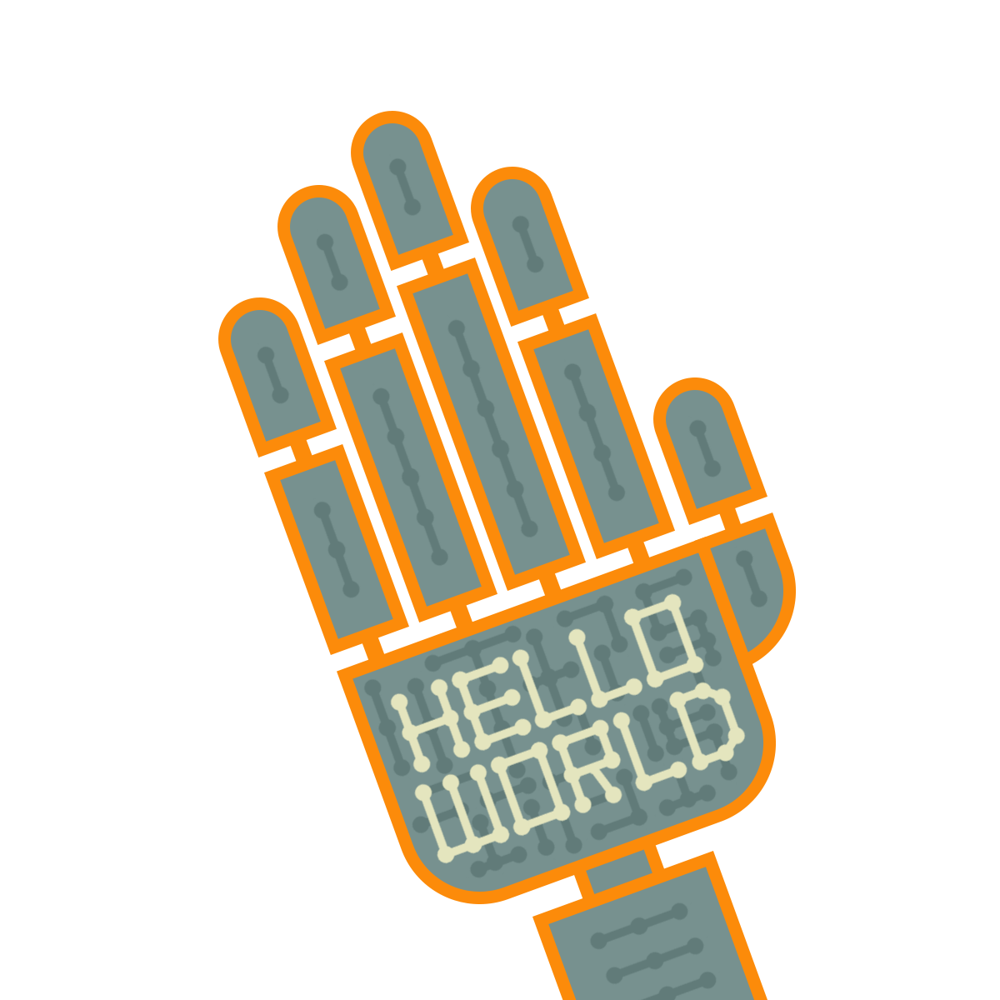

Project Reality: 2018 IT PDP Conference
---------------------------------------

  

  

  

Project Reality is a web application that is intended to act as the 
conference management tool for the 2018 IT PDP conference (to be held on 21st
 November 2018 inshAllah). See the *Key Features* section below for an overview.

Prerequisites
-------------
- Python 3+ (see requirements.txt file)

How to Run
----------
Back End Code (located in `/API`):
1. Install all the dependencies (e.g. `pip install -r requirements.txt`).
2. Run the back end server via invoking `python manage.py runserver`.
3. Launch a browser and connect to the server (e.g. 127.0.0.1:8000/admin).

Front End Code (located in `/website`):
1. Execute the `index.html` and your browser will launch.

Key Features
------------
- Splash page, allows connection to a conference session.
- Agenda page, displays the agenda of the conference.
- Booths page, displays the floor plan of the booths.
- Q&A session page, allows interactive posting and voting of questions. 

Authors
-------
- Yaqeen Mahdi
- Othman Alikhan
- See About page for more details

TODO
----
- Update the agenda with the mobile friendly infographic
- Add rectangular instructions to Metaverse page
- Develop the 'Committee' page that contains theme and hierarchy
- Ensure everyone's name is correct (Ask Aqeel for corrected name list)

Bugs
----
- None
